```{r xaringan-setup, include=FALSE, warning=FALSE}
library("xaringanthemer")
library("dplyr")
library("kableExtra")

extra_css <- list(
  ".small" =  list(`font-size` = "80%"),
  ".large" =  list(`font-size` = "150%"),
  ".huge" =  list(`font-size` = "300%"),
  "ul li" = list(`margin-bottom` = "10px"),
  ".gray" = list(color = "#C0C0C0"),
  ".red" = list(color = "#FF0000"),
  ".blue1" = list(color = "#3AABBE"),
  ".blue2" = list(color = "#2A6D90"),
  ".blue3" = list(color = "#446874"),
  ".purple" = list(color = "#624474"),
  ".mutedred" = list(color = "#745344"),
  ".green" = list(color = "#348338",
                `font-weight` = "600"),
  ".code-box" = list(display = "inline-block",
    width = "95%",
    `line-height` = "1.25em",
    padding = "5px",
    `font-size` = "80%",
    `background-color` = "#f6f6f6",
    `align-items` = "left",
    `font-family` = "Courier Prime",
    border = "1px solid black"),
  "a" = list(color = "#3AABBE"),
  "a:hover" = list("text-decoration" = "underline")
)
# set up fonts
style_mono_accent(
  base_color = "#446874",
  header_font_google = google_font("DM Sans"),
  text_font_google   = google_font("DM Sans", "400", "400i"),
  code_font_google   = google_font("Courier Prime"),
  extra_css = extra_css
)

xaringanExtra::use_tile_view()
```

<style type="text/css">
.remark-slide-content {
    font-size: 22px
}
.remark-code, .remark-inline-code {
    font-size: 18px;
}
</style>

## Acknowledgments

This work was done in collaboration with:

```{r acknowledgments, echo = FALSE, fig.show = "hold", out.width = "75%", fig.align = "center"}
knitr::include_graphics(c(
    "img/slides_images_part1.png"
  ))
```

with many thanks to:
```{r acknowledgments-2, echo = FALSE, fig.show = "hold", out.width = "75%", fig.align = "center"}
knitr::include_graphics(c(
    "img/slides_images_part2.png"
  ))
```

---

## Motivation

.pull-left[
```{r amp-1, echo = FALSE, out.width = "75%", fig.align = "center"}

```

.small[ NIH NIAID-sponsored HVTN + HPTN phase 2b HIV prevention efficacy trial; statistical design described in Gilbert et al. (2017) _Stat Commun Infect Dis_ ]

```{r neut-hiv, echo = FALSE, out.width = "75%", fig.align = "center"}
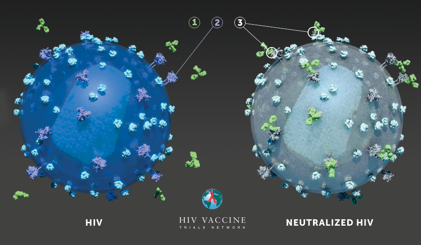
```
]

.pull-right[
```{r predprobs, echo = FALSE, out.width = "90%", fig.align = "center"}
knitr::include_graphics("img/pred_prob_resistance_slapnap.png")
```

.small[ Magaret, Benkeser, Williamson et al. (2019) _PLoS Comput Biol_ ]
]

---

## Snapshot: HVTN + HPTN planned bnAb clinical testing\*

```{r bnab-table, echo = FALSE}
bnab_tab <- tibble::tibble(
  `bnAb regimen` = c("VRC01", "VRC07-523-LS", "PGT121", "VRC07-523-LS + PGDM1400", "VRC07-523-LS + PGT121", "VRC07-523-LS + 10-1074", "VRC07-523-LS + PGT121 + PGDM1400", "VRC01/PGDM1400-10E8v4 (trispecific)"),
  `Clinical Trial(s)` = c("HVTN 703,704/HPTN 081,085", "HVTN 121, 127/HPTN 087", "HVTN 130/HPTN 089", "HVTN 130/HPTN 089", "HVTN 130/HPTN 089 and HVTN 136/HPTN 092", "HVTN 130/HPTN 089", "HVTN 130/HPTN 089", "HVTN 129/HPTN 088"),
  `Publicly-available observations` = c(828, 402, 656, 402, 402, 402, 402, 205)
)
knitr::kable(bnab_tab) %>%
  kableExtra::kable_styling(font_size = 18)
```

\* As of January 2020

---

## Critical issues in bnAb HIV prevention research

For a given bnAb regimen (e.g., 1-, 2-, 3-bnAb, multispecific):

--

* what is the regimen's neutralization breadth*?

--

* what is the regimen's neutralization potency*?

--

.small[ *against HIV-1 viruses circulating in the relevant population]

--

We can address these questions with available data and machine learning.

---

## Data structure and notation

In general: data $Z_1, \ldots, Z_n \stackrel{iid}{\sim} P_0$

--

* $Z_i := (X_i, Y_i);$

--

* $X_i \in \mathbb{R}^p$ is a vector of covariates;

--

* $Y_i \in \mathbb{R}$ is the outcome of interest;

--

&zwj;**Goals**:
1. Do a .green[good job] predicting $Y$ using $X$

--

2. Understand how the features $\{X_j\}_{j = 1}^p$ .green[affect] predictions

--

3. Ensure approaches to (1) and (2) are .green[reproducible]


---

## Data structure and notation

&zwj;**Goals**:
1. Do a .green[good job] predicting $Y$ using $X$
2. Understand how the features $\{X_j\}_{j = 1}^p$ .green[affect] predictions
3. Ensure approaches to (1) and (2) are .green[reproducible]

&zwj;**Questions**:

--

1. How to .blue1[assess] prediction performance?

--

2. What do we mean by .blue1[affecting predictions]?

--

3. How to .blue1[encode many decisions] in a pipeline?

---

## Containerization: the problem

Trying to run someone else's code:
.code-box[
\> library(ggplot2) <br>
.red[Error in library(ggplot2) : there is no package called ‘ggplot2’] <br>
\> install.packages("ggplot2") <br>
.red[configure: error: no acceptable C compiler found in $PATH] <br>
]

--

You Google the error, install `gcc`, re-install the package. On the next line:
.code-box[
\> library(xgboost) <br>
.red[Error in library(xgboost) : there is no package called ‘xgboost’] <br>
\> install.packages("xgboost") <br>
.red[package ‘xgboost’ is not available (for R version 3.2.0)]
]

--

... so you update `R`
--
 ... but this breaks the fix for `ggplot2`.

---

## Containerization: the problem

Making code reproducible for *you* $\neq$ reproducible for __someone else__:

--

* Are the data publicly-available? Or behind a firewall?

--

* Can your code run on any operating system?

--

* What dependencies (e.g., packages) does your code rely on?

--

* Does your code rely on specific versions of software?

--

* ...

--

We want to package up all __analysis code and software__, allowing us to:
* reproduce the analysis in its entirety, anywhere
* control the environment exactly

---

## Containerization: the solution

Think of a _container_ as a __virtual machine__:

--

* has its own operating system

--

* has its own file system

--

* has its own software applications

--

**You** specify all details for the container; users then .blue1[run] the container.

--

[Docker](https://www.docker.com/) is a popular containerization program.

---

## Docker process

To create and run a container using Docker:

--

1. Write a `Dockerfile`: plain text telling Docker what to put in your _image_.

--

2. Build the image (using `docker build`).

--

3. Run the image (using `docker run`; creates the container) to execute code.

---

## Example: downloading and processing data

&zwj;CATNAP: publicly-available database .small[ [Yoon et al. (2015) _Nuclic Acids Res_] ]:

* $\text{IC}_{50}$ and $\text{IC}_{80}$ neutralization values
  - $\text{IC}_{x}$: concentration that neutralizes $x$ percent of pseudoviruses

--

* several derived outcomes:
  - for $J$ nAbs, $\text{predicted IC}_{k} = \left(\sum_{j=1}^J \text{IC}_{k,j}^{-1}\right)^{-1}$
  - $\text{Estimated sensitivity} = \text{predicted IC}_{50} < 1$
  - $\text{Multiple sensitivity} = \sum_{j=1}^J(\text{IC}_{50, j} < 1) \geq 2$

---

## Example: downloading and processing data

&zwj;CATNAP: publicly-available database .small[ [Yoon et al. (2015) _Nuclic Acids Res_] ]:

* Input feature groups:
  * Amino acid sequence sites: gp120 CD4 binding sites, gp120 V2, gp120 V3, gp41 MPER
  * Other groups: Region-specific counts of PNG sites, viral geometry, cysteine counts

---

## Example: downloading and processing data

**S**uper **L**e**A**rner **P**rediction of **NA**b **P**anels (SLAPNAP):

--

* packaged as a Docker container

--

* options allow for simple CATNAP data pulling and cleaning

--

Example run (on Ubuntu): neutralization data for bnAb VRC01 (used in AMP)
```{bash, eval = FALSE}
sudo docker pull slapnap/slapnap
sudo docker run \
  -v "<path to desired output directory>:/home/output/" \
  -e nab="VRC01" \
  -e return="data" \
  slapnap
```

```{r data-example, echo = FALSE, out.width = "90%", fig.align = "center"}
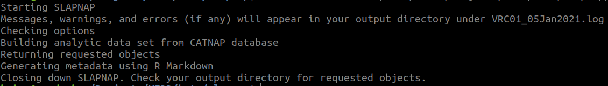
```
---

## Example: under the hood

To make the container that pulls CATNAP data, we need to:

--

.pull-left[
* specify the operating system
* install necessary software
  * pull data from web (`wget`)
  * `R` (for data cleaning; specify a version)
  * `pandoc` (for Rmarkdown metadata)
* install specific R packages
]
--
.pull-right[
* make directories
  * store data
  * store code
  * store output
* copy code into the container
* specify user options (e.g., `nab`)
* download CATNAP data
]

---

## Example: under the hood

```{r data-example-dockerfile-0, echo = FALSE, out.width = "90%", fig.align = "center"}
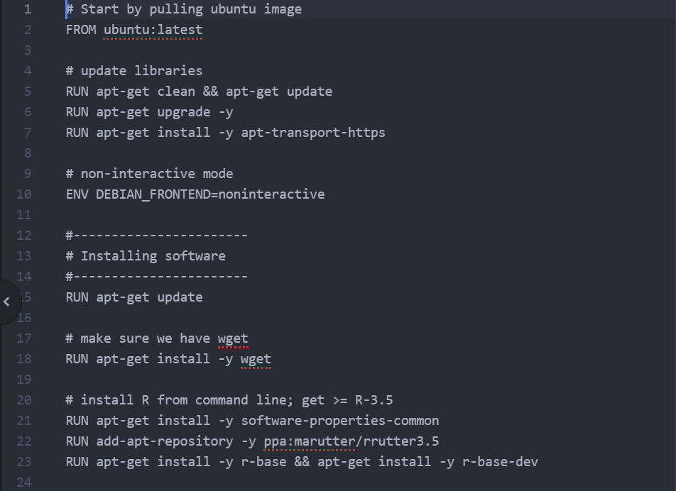
```
---

## Example: under the hood

```{r data-example-dockerfile-1, echo = FALSE, out.width = "90%", fig.align = "center"}
knitr::include_graphics("img/dockerfile_init_1.png")
```
---

## Example: under the hood

```{r data-example-dockerfile-2, echo = FALSE, out.width = "90%", fig.align = "center"}
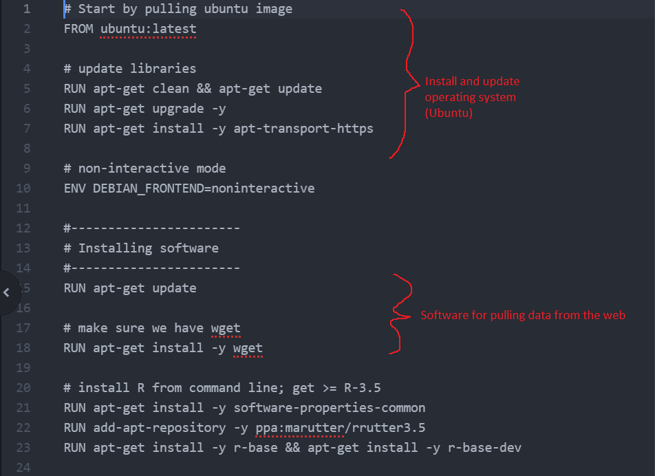
```
---

## Example: under the hood

```{r data-example-dockerfile-3, echo = FALSE, out.width = "90%", fig.align = "center"}
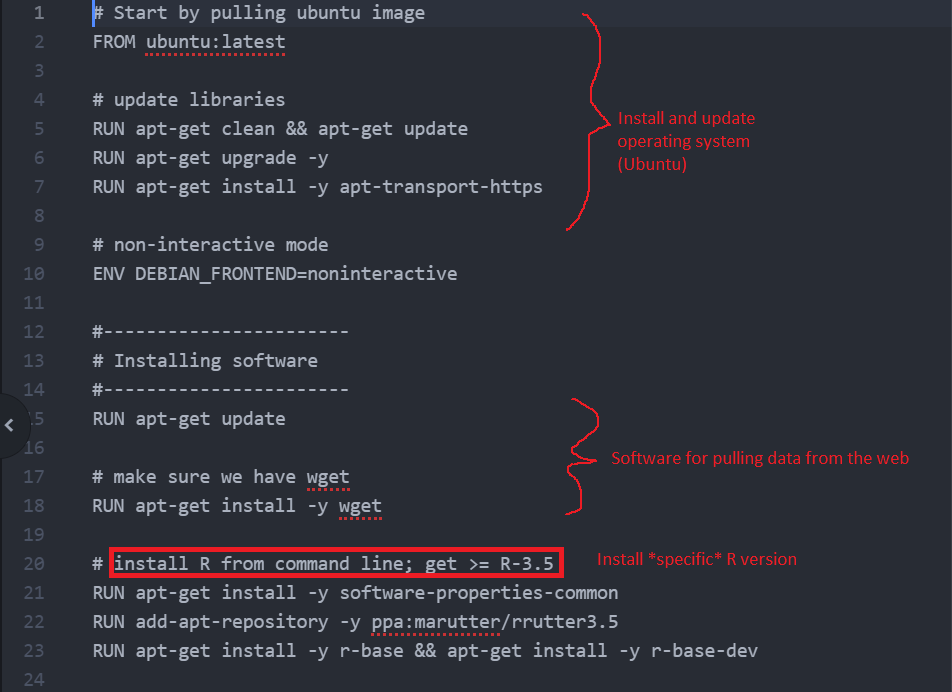
```
---

## Example: under the hood

```{r data-example-dockerfile-4, echo = FALSE, out.width = "90%", fig.align = "center"}
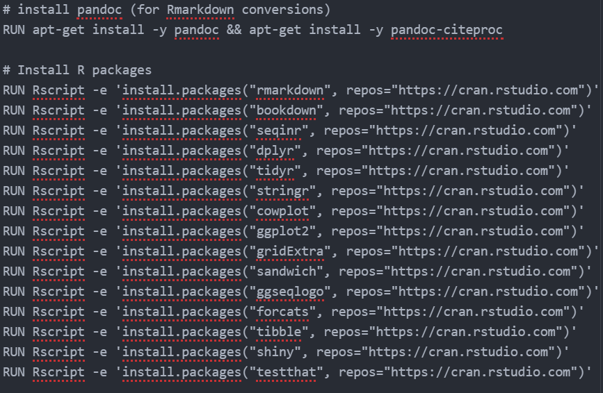
```
---

## Example: under the hood

```{r data-example-dockerfile-5, echo = FALSE, out.width = "60%", fig.align = "center"}
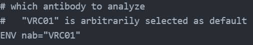
```
---

## Example: under the hood

```{r data-example-dockerfile-6, echo = FALSE, out.width = "100%", fig.align = "center"}
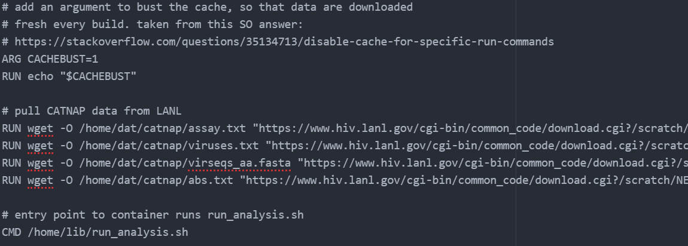
```
---

## Example: under the hood

Example `run_analysis.sh`:
```{r data-example-dockerfile-7, echo = FALSE, out.width = "100%", fig.align = "center"}
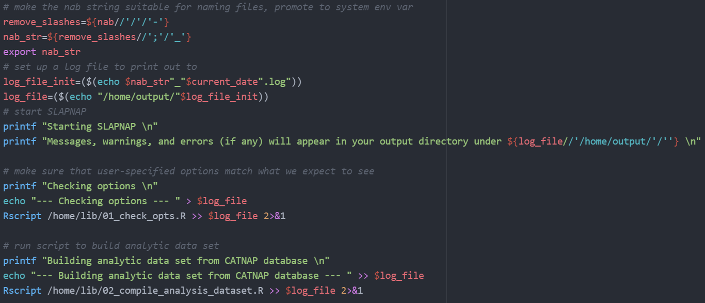
```
---

## Predicting neutralization sensitivity

Predicting neutralization sensitivity (e.g., $\text{IC}_{50}$) using CATNAP data:

--

* want .green[good] predictions

--

* how to .blue1[assess] this?

--

Goodness of fit!

Common measures:

--

* Regression: $R^2$ (MSE)

--

* Classification: accuracy, AUC

--

With simple algorithms (e.g., linear regression):

--

* point estimates .blue1[unbiased]

--

* .blue2[inference] on population quantity

---

## More complex algorithms

Your collaborator says "let's use machine learning!":

--

What algorithm to use?

--

* lasso, for sparsity?

--

* random forests, because trees?

--

* neural networks, for complex relationships?

--

Why not .blue1[combine] these estimators!

---

## Stacking and super learning

&zwj;.blue1[Stacking] .small[ [e.g., Wolpert (1992), _Neural Networks_] ]:

--

* specify a _library_ of learners (e.g., lasso, random forests)
  * can have varying tuning parameters

--

* use cross-validation to build an _ensemble_ of these learners

--

&zwj;.blue2[Super learning (SL)] .small[ [van der Laan et al. (2007), _Stat Appl Genet Mol Biol_] ]:
* specific implementation of stacking
* nice asymptotic guarantees

--

**Questions**
* .red[are point estimates of predictivness unbiased]?
* .red[can we do inference]?

---

## Cross-validated predictiveness

Using .blue1[cross-validated] measures of predictiveness can help. .small[ [e.g., Hubbard et al. (2016), _Int J Biostat_] ]

For each of $K$ folds:
* learn $f_{n,k}$ (.blue1[fixed]) from training data
* $P_{n,k}$: empirical distribution based on validation data

--

&zwj;Examples:

* .small[ .blue1[Population] ] ${\small \text{CV-}R^2(P_0) = 1 - \frac{K^{-1}\sum_{k=1}^K E_{P_0}\{Y - f_{n,k}(X)\}^2}{var_{P_0}(Y)}}$

--

  * ${\small \text{CV-}R^2(\{P_{n,k}\}_{k=1}^K) = 1 - \frac{K^{-1}\sum_{k=1}^K E_{P_{n,k}}\{Y - f_{n,k}(X)\}^2}{var_{P_n}(Y)}}$

--

* .small[ .blue1[Population] ] ${\small \text{CV-AUC}(P_0) = K^{-1}\sum_{k=1}^K P_0\{f_{n,k}(X_1) < f_{n,k}(X_2) \mid Y_1 = 0, Y_2 = 1\}}$ ]

--

  * ${\small \text{CV-AUC}(\{P_{n,k}\}_{k=1}^K) = K^{-1}\sum_{k=1}^K P_{n,k}\{f_{n,k}(X_1) < f_{n,k}(X_2) \mid Y_1 = 0, Y_2 = 1\}}$

---

## Cross-validated predictiveness

&zwj;Pros:
* .blue1[simple] estimator
* .blue1[inference] based on the efficient influence function (EIF)
* good .blue2[small-sample] properties .small[ [Benkeser et al. (2019)] ]

--

&zwj;Cons:
* .red[correct target parameter]?

---

## Population predictiveness

We can instead view predictiveness as a .blue1[population] quantity. .small[ [e.g., Williamson et al. (2020), _arXiv_] ]

--

&zwj;Define:

* $V(f, P)$: .blue1[predictiveness] of $f \in \mathcal{F}$ under distribution $P$

--

* $f_0 := \underset{f \in \mathcal{F}}{\text{arg}\,\text{max}}\, V(f, P_0)$: _oracle prediction function_ in $\mathcal{F}$

--

$V(f_0, P_0)$: _oracle predictiveness_

--

Example measures:
* $R^2(P_0) = 1 - E_{P_0}\{Y - f_0(X)\}^2 / var_{P_0}(Y)$
* $\text{AUC}(P_0) = P_0\{f_0(X_1) < f_0(X_2) \mid Y_1 = 0, Y_2 = 1\}$

---

## Population predictiveness

&zwj;Pros:
* .blue1[simple] estimator
* .blue1[inference] based on the efficient influence function (EIF)

&zwj;Cons:
* .red[need larger sample size]

---

## Example: adding Super Learning to the container

Adding the regression task to the container:
1. Create new `R` script that runs SL

--

2. Add to `Dockerfile`:
  * install `R` packages (e.g., `SuperLearner`, `xgboost`, `glmnet`)
  * copy new `R` script into container
  * make executable

--

3. Add to `run_analysis.sh`:
  * call new `R` script

---

## Example: Super Learning

```{bash sl-example-bash, eval = FALSE}
sudo docker run \
  -v "<path to desired output directory>:/home/output/" \
  -e nab="VRC01" \
  -e learners="lasso;rf;xgboost" \
  -e nfolds="5" \
  -e return="data;learner" \
  slapnap
```
```{r sl-example, echo = FALSE, out.width = "100%", fig.align = "center"}
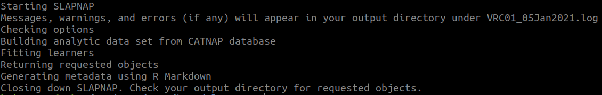
```

---

## Understanding predictions

Distinguishing between contributions of predictions...

--

* (.blue1[extrinsic importance]) ... .blue1[by a given (possibly black-box) algorithm]
  .small[ [e.g., Breiman, (2001)] ]

--

* (.blue1[intrinsic importance]) ... .blue1[by best possible (i.e., oracle) algorithm]
  .small[ [e.g., van der Laan (2006)] ]

--

Example use of .blue1[extrinsic] variable importance:
* how does my algorithm use a given covariate in predictions?

--

Example use of .blue2[intrinsic] variable importance:
* is it worth collecting a given covariate for the sake of predicting neutralization sensitivity?

---

## Inference on population variable importance

.blue1[Intrinsic] importance can be defined using _oracle predictiveness_.

--

&zwj;Define:
* $f_{0,s} := \underset{f \in \mathcal{F}_{-s}}{\text{arg}\,\text{max}}\, V(f, P_0)$: _oracle prediction function_ in $\mathcal{F}_{-s}$
* $V(f_{0,s}, P_0)$: _residual oracle predictiveness_

--

.green[Importance]: $V(f_0, P_0) - V(f_{0,s}, P_0)$

--

Valid estimation and inference .blue1[using simple, plug-in estimators]!

.small[ [Williamson et al. (2020), _Biometrics_; Williamson et al. (2020), _arXiv_; extended in Williamson and Feng (2020), _ICML_] ]

---

## Example: adding variable importance to the container

Adding the regression task to the container:
1. Add additional regressions to SL `R` script

--

2. Create new `R` script that estimates importance

--

3. Add to `Dockerfile`:
  * install `R` package `vimp`
  * copy new `R` script into container
  * make executable

--

4. Add to `run_analysis.sh`:
  * call new `R` script

---

## Example: putting it all together

```{bash example-all, eval = FALSE}
sudo docker run \
  -v "<path to desired output directory>:/home/output/" \
  -e nab="VRC01" \
  -e learners="lasso;rf;xgboost" \
  -e nfolds="5" \
  -e importance_ind="marg;pred" \
  -e importance_grp="marg;cond" \
  -e return="data;learner;report" \
  slapnap
```

```{r example-all-r, echo = FALSE, out.width = "100%", fig.align = "center"}
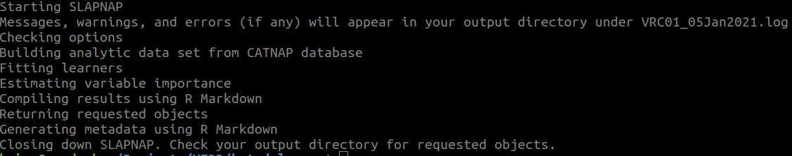
```

[example full report](https://benkeser.github.io/slapnap/reports/report_VRC01.html)
---

## Studying SLAPNAP performance

We evaluated SLAPNAP in two analyses:

--

* Studying .blue1[all single bnAbs] in CATNAP

--

  Compared against two methods:
    * Hake and Pfeifer (2017): support vector machines
    * Rawi et al. (2019): gradient boosted trees

--

* Studying .green[combination regimens] with sufficient data

--

  Includes several regimens currently in clinical testing

---

## Single-bnAb performance

```{r single-nab, echo = FALSE, out.width = "100%", fig.align = "center"}
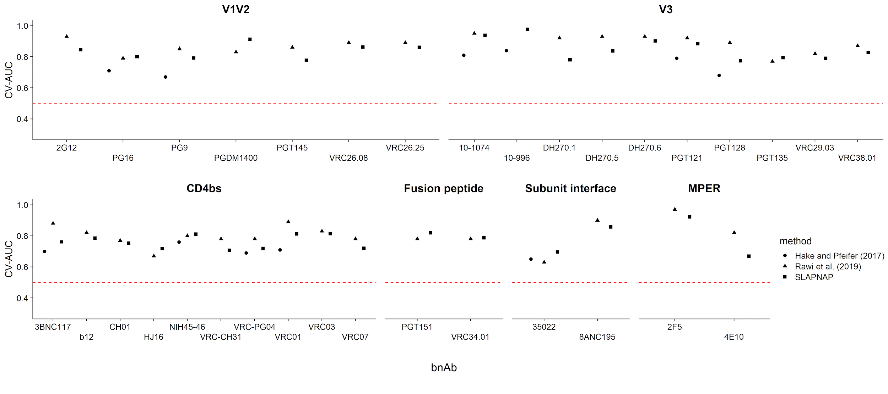
```

--

.pull-left[
Overall median CV-AUCs: 0.71 (HP), 0.84 (Rawi), 0.8 (SLAPNAP)
]

.pull-right[
No clear winner over all epitopes
]

---

## Combination-regimen performance

```{r multi-nab, echo = FALSE, out.width = "70%", fig.align = "center"}
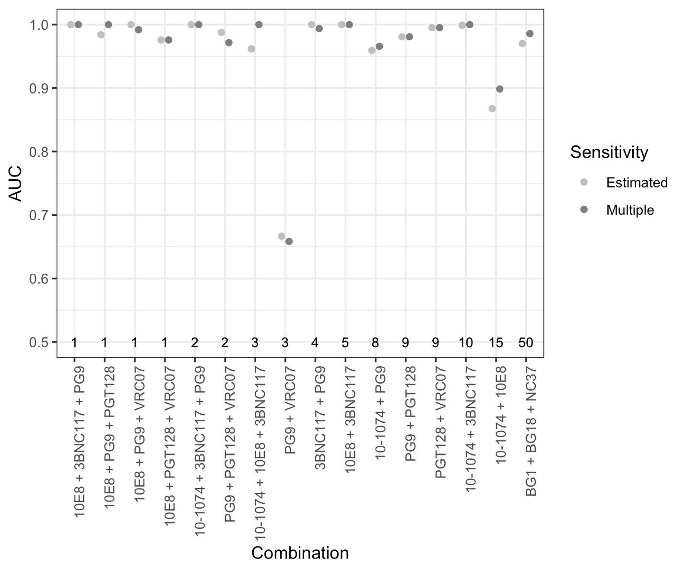
```
---

## Future work

Aspects of this approach are being adopted in several current studies:
* HVTN immune correlates analyses
* CoVPN immune correlates analyses
* WHI metabolomics studies

--

Avenues for future work:
* web-based tools
* adding learners to SLAPNAP
* variable selection (my postdoctoral focus)
* other variable importance measures (e.g., time-varying AUC)

---

## Closing thoughts

* .blue1[Containerization] can help ensure reproducibility

--

* .blue1[Inference] in the context of machine learning:
  * prediction performance: .green[rigorous assessment]
  * variable importance: .green[understanding contributions] in prediction

--

* HIV bnAb pipeline implemented in open-source software `SLAPNAP`

--

[source code](https://github.com/benkeser/slapnap) | [Docker image](https://hub.docker.com/r/slapnap/slapnap) | [preprint (bioRxiv)](https://www.biorxiv.org/content/10.1101/2020.06.23.167718v1)

`r icon::fa('github')` https://github.com/bdwilliamson
`r icon::fa('globe')` https://bdwilliamson.github.io

---

## References

* .small[ Benkeser D, Peterson M, and van der Laan MJ. 2019. Improved Small-Sample Estimation of Nonlinear Cross-Validated Prediction Metrics. _Journal of the American Statistical Association_. ]
* .small[ Breiman, L. 2001. Random forests. _Machine Learning_.]
* .small[ Gilbert PB, Juraska M, deCamp AC, Karuna S, et al. 2017. Basis and Statistical Design of the Passive HIV-1 Antibody Mediated Prevention (AMP) Test-of-Concept Efficacy Trials. _Statistical Communications in Infectious Diseases_. ]
* .small[ Hubbard AE, Kherad-Pajouh S, and van der Laan MJ. 2016. Statistical Inference for Data Adaptive Target Parameters. _International Journal of Biostatistics_. ]
* .small[ Magaret CA, Benkeser DC, Williamson BD, et al. 2019. Prediction of VRC01 neutralization sensitivity by HIV-1 gp160 sequence features. _PLoS Computational Biology_. ]
* .small[ van der Laan, MJ. 2006. Statistical inference for variable importance. _The International Journal of Biostatistics_.]
* .small[ van der Laan MJ, Polley EC, and Hubbard AE. 2007. Super Learner. _Statistical Applications in Genetics and Molecular Biology_. ]

---

## References

* .small[ Williamson B, Gilbert P, Carone M, and Simon N. 2020. Nonparametric variable importance assessment using machine learning techniques (+ rejoinder to discussion). _Biometrics_. ]
* .small[ Williamson B, Gilbert P, Simon N, and Carone M. 2020. A unified approach for inference on algorithm-agnostic variable importance. _ArXiv technical report_. ]
* .small[ Williamson B and Feng J. 2020. Efficient nonparametric statistical inference on population feature importance using Shapley values. _ICML_. ]
* .small[ Wolpert DH. 1992. Stacked generalization. _Neural Networks_. ]
* .small[ Yoon H, Macke J, West AP, et al. 2015. CATNAP: a tool to compile, analyze and tally neutralizing antibody panels. _Nucleic Acids Research_. ]
